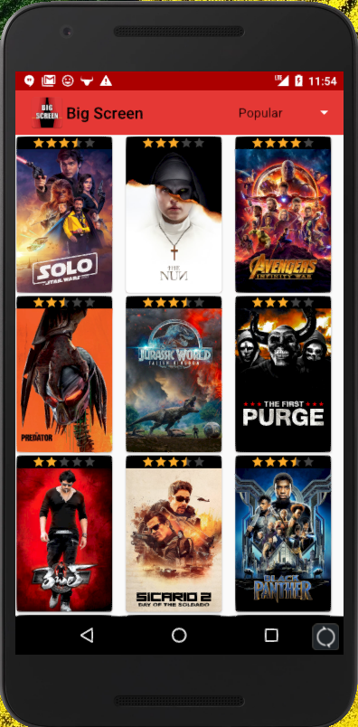
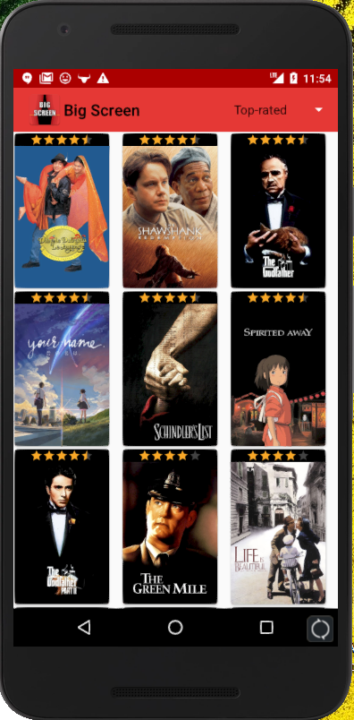
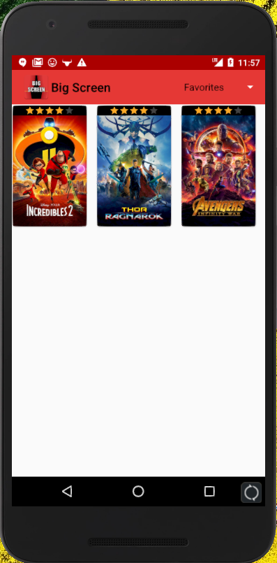
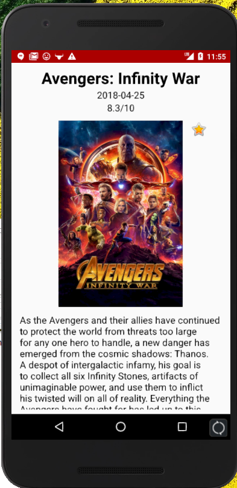
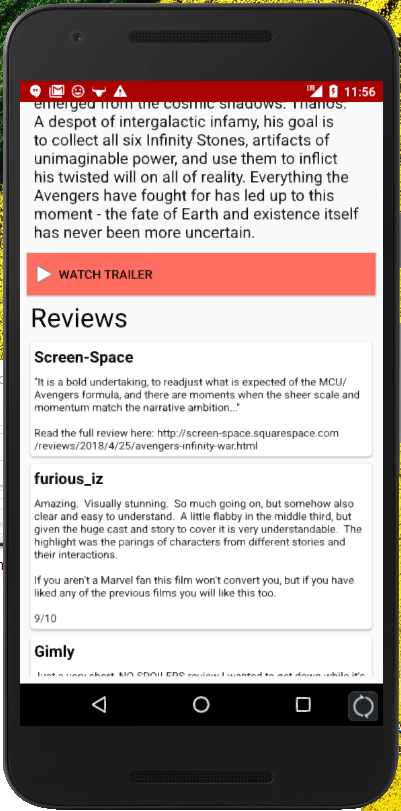

# BigScreen
BigScreen - A Movie Browsing App  
BigScreen is an Android Application written in java that displays images and information about recent movies.  
The data is fetched in JSON format from TheMovieDb Api service using Retrofit.  
 
The movie titles can be sorted by popular:  
  
 
The movie titles can also be sorted by top-rated:  
  
 
Movies can be favorited and persistently stored to be viewed at a later time or offline  
  
Clicking on an image shows detailed information about the movie such as title, summary, rating, date released, and reviews. There is also a link to view the trailer on Youtube.  
 
  
  
 
To try out the application, sign up for an api key at https://www.themoviedb.org/documentation/api and enter your api key at network/NetworkApi
